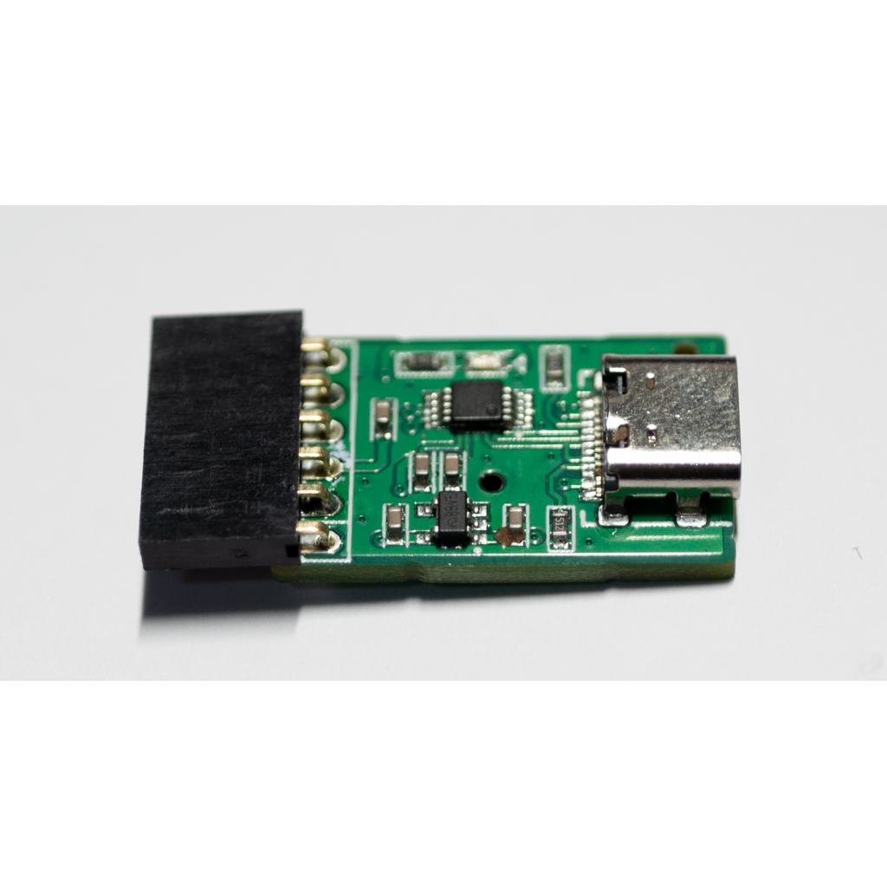
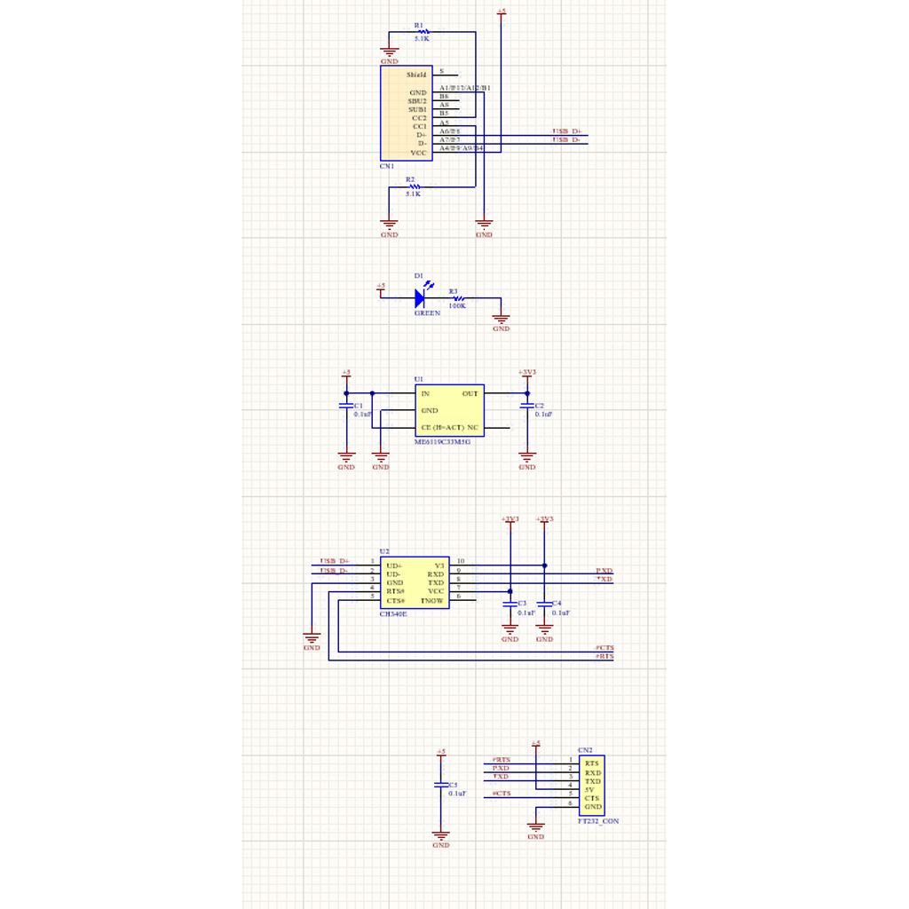
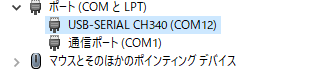
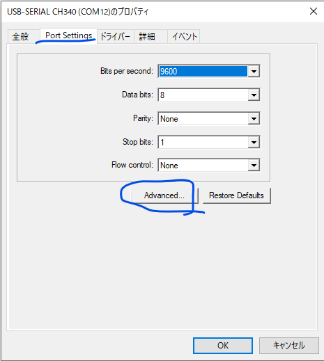
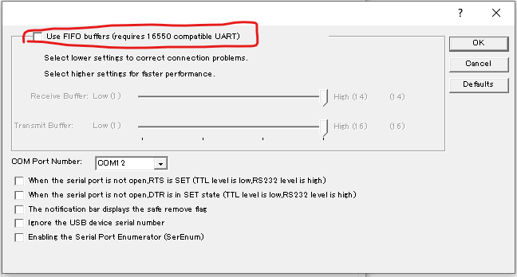

# AN-228 USBシリアル変換モジュール(CH340E使用)

# 商品説明

CH340Hを使用したシリアル通信用モジュールです。

Type-Cで接続できるため非常にお手軽です。
        
電圧レベルはTTL 3.3Vです。

**ピンは全て実装済みです**

※ドライバーが別途必要になります。　最新のドライバーは公式サイト　https://www.wch.cn/products/CH340.html?from=list
より

# 仕様

- 基板サイズ   25 x 16 mm
- パッド：両面スルーホール（1mm穴 2mmパッド）
- 基板厚：1.6mm
- 機能：
      UARTに対応した通信
      CTS/RTSに対応
      USB Type-Cコネクタ使用

# 内容物 

- 実装済み基板　１枚

# 資料

 - 回路図 & 外形寸法 & 部品表

   

   

# 販売サイト

- Amazon JP (ピン未実装、半田が必要なモデル）

   https://amzn.asia/d/dPPRC6k

# トピック

## 上手く受信していない？データが欠けてる？

   TeraTerm等でテストしている際に、何Byteか表示されない事がありました。

   原因はドライバーの初期設定でFIFOにチェックが入っており、溜まり次第表示になっていました。

   以下の通りデバイスマネージャで変更する事をオススメ致します。

   

   デバイスマネージャで、CH340Eをダブルクリック

   

   **PortSetting** を選択し、**Advanced** をクリックします

   
   
   一番上に **Use FIFO Buffers**　と書いてある箇所にチェックが入っていますので、それを **外し ます。

   
## Q.FT232で受信出来たけどCH340Eじゃ受信できなかった（もしくは文字化けした）

   どうもFH232(FTDI社)は受信の仕組みが違うようで、特別綺麗にデータが取れます。
   
   CH340Eで化ける際は、送信側がBaud Rate Error (%)（タイミング誤差によるエラー）が大きくなっていないか確認してみてください。
   
   CH340Eは幅が狭い場合があります。その際はFT232を使った方が良いです。(経験談)

   どうしてもCH340Eを使用する際は、速度を落としてエラーを減らすと送受信できるようになります。

## Q.マイコンの電源を切ったのにシリアルデータが送信されてる

   どうもCH340E、漏れ電流が少し大きいのか、電源を切ったにも関わらず、回り込んでマイコンを動かそうと頑張る様です。
   
   一文字送って電流不足でリセットされるような挙動を繰り返している様にも思えます。

   良い状態ではありません。使用後は接続を切った方が良いと思います。

<meta name="google-site-verification" content="6oX8ek_6AuKv8MAZi7VcgUb88NGj_nkkWuNGp6OH1JA" />
